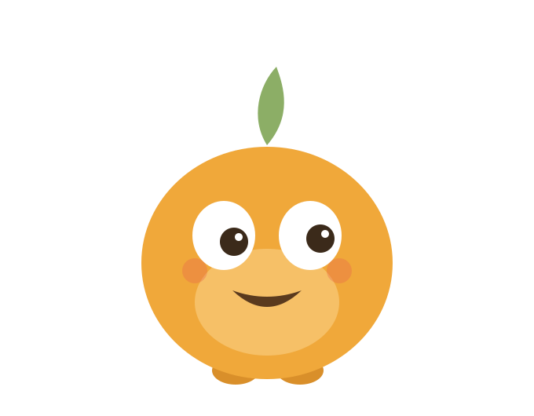

  

<h1 align="center">Larder</h1>

  Take a photo of what's in your fridge. Get something you can cook tonight.

---

Larder is an iPhone app for students who cook on a small budget. You show it what food you have, it tells you what you can make with it, roughly what it costs, and how it fits the goal you're working toward. Nutmeg, the little round guy up there, helps you along the way.

I'm a high school student, and I built Larder on my own. It started as a hackathon project, but somewhere along the way I started actually using it, a lot more than I expected to. So it isn't just a hackathon project anymore. It's something I'm going to keep working on, and it's [free and open source](#free-and-staying-open-source) on purpose.

## What it does

**Update your pantry.** Take a few photos in a row, scan barcodes, or type things in. Larder shows you everything it thinks it found, with amounts, and nothing gets saved until you've checked it.

**Recipes you can make right now.** 61 recipes, sorted by how much of each one you already have. Filter by ready now, quick, cheap, no stove, high protein, or your favorites. After you cook something you can give it a thumbs up or down, and that nudges what shows up next.

**Your next meal on Home.** In the morning it suggests breakfast, at lunch it suggests lunch, and so on. It won't suggest the thing you just ate.

**Cook Mode.** Step by step, with timers that ring even when your phone is locked, and count down on your lock screen. Nutmeg stands in a little kitchen that changes with each step, so when the step says boil, there's a pot boiling.

**Goals and nutrition.** Pick a goal (build muscle, lose weight, gain weight, stay fit, or "just cook" if you don't want numbers). Every recipe shows calories and macros per serving. Apple Health sync is optional and only saves the meals you cook.

**Shopping list.** When you run out of something it can go on the list by itself. "Add what's missing" puts a recipe's missing ingredients on the list with amounts. When you tick things off, they move into your pantry, and if you already had some, the amounts add up.

**Streak.** Seven Nutmegs for the week, one for each day you cook. No streak freezes and no guilt trips if you miss a day.

**Chat with Nutmeg** (Larder Plus). Type or talk. Ask what to make, what you're running low on, or how today's calories and protein look. Say "I bought 6 eggs" and he'll offer to update your pantry. You tap to confirm.

**Nutmeg's looks.** Coral unlocks after you've cooked a few times. Snow and Harvest come with Larder Plus. Each look changes the colors of the whole app, in light and dark mode, and can switch the app icon to match.

**Privacy.** Photos and voice messages stay on your phone. A barcode scan sends only the barcode number. If you turn on online recipes, it sends a few ingredient names plus your goal and diet. There are no accounts and no sign in.

## Free, and staying open source

A lot of calorie and meal apps lock the useful parts behind a subscription, and a student budget doesn't stretch that far. That's a big part of why I made Larder, and it's why Larder is going to stay open source. If you'd rather not pay for anything, you can build it and run it on your own iPhone for free. All you need is a Mac, Xcode and a free Apple account (see [Running the project](#running-the-project)). Builds from this repo use RevenueCat's Test Store, so Larder Plus unlocks without being charged. One heads-up: apps installed with a free Apple account need reinstalling from Xcode every 7 days. That's Apple's rule, not mine.

## How Larder uses RevenueCat

- The [purchases-ios](https://github.com/RevenueCat/purchases-ios) SDK, installed with Swift Package Manager. Users stay anonymous, since the app has no accounts.
- One entitlement, `larder_plus`, and one offering with two packages: monthly, and a six month "semester" plan, because that's how students think about time and money.
- The paywall is my own SwiftUI screen, built from the offering that RevenueCat returns. Prices come from the packages. The "save X%" on the semester plan is calculated from the two real prices, so it's always right if the prices change.
- `PurchaseStore` listens to `customerInfoStream`, so Plus turns on the second a purchase or restore finishes. After buying, you get a welcome screen that shows what you just unlocked.
- The paywall appears once during onboarding, after you've already scanned your pantry and seen a real recipe. "Not now" is one tap and gives the same haptic as buying.
- Everything that makes the app useful stays free: scanning, recipes, nutrition, goals, the shopping list, Health sync and the Coral look. Plus is Nutmeg chat, the budget and nutrition insights, and the seasonal looks and icons.
- Debug builds use RevenueCat's Test Store, so anyone can try the full purchase flow without an App Store account.

## How it's built

Larder is native Swift and SwiftUI, around 19,000 lines across 137 files, with no backend. Everything lives on the phone.

### App structure

- **SwiftUI + SwiftData.** Four models (`PantryItem`, `ShoppingItem`, `CookedMeal`, `RecipeNote`). New fields are optional, so SwiftData migrates old data by itself.
- **Swift concurrency.** The project defaults to main actor isolation. Pure logic (matching, nutrition math, parsing) is marked `nonisolated` so it's easy to test. Heavy work like scanning photos runs off the main thread with `@concurrent`.
- **Observation.** App state uses `@Observable`. The color theme is an observable store too, so changing Nutmeg's look recolors every screen at once without passing anything around.
- Screens are split by feature: `Scanning`, `Recipes`, `CookMode`, `Pantry`, `Nutmeg`, `Insights`, `Onboarding`, `Paywall`, `Online`.

### Scanning a pantry

Phones with and without Apple Intelligence both work.

1. **Vision** runs on every phone. It classifies the image (`ClassifyImageRequest`) and reads any text on packaging (`RecognizeTextRequest`), then matches both against a catalog of ingredients.
2. On Apple Intelligence phones, the **Foundation Models** framework also looks at the photo, using `@Generable` types so the answer comes back as structured data (item names and rough counts) instead of text I'd have to parse.
3. The on-device model sometimes invents things. So `ScanAggregator` runs it more than once and compares. An item only gets marked "Looks right" if the model named it more than once or Vision saw it too. Everything else shows up as "Maybe", and the person decides.
4. Several photos can be taken in a row. A small queue (`ScanQueue`) processes them in the background while you keep shooting, and the results are merged.
5. Barcodes use VisionKit's live scanner. The number is looked up on Open Food Facts and cached on the phone.

### Recipes and nutrition

- The 61 recipes are bundled as JSON. Every ingredient line has a weight in grams, and there are tests that check every recipe with chicken, pork, beef, turkey, fish or sausage states the safe internal temperature, that shrimp and eggs get cooked through, and that raw meat recipes tell you to wash up.
- Nutrition is worked out on the phone from a USDA FoodData Central table (98 foods). Daily targets use the Mifflin-St Jeor equation, with height, weight and age from Apple Health if you allow it.
- `RecipeMatcher` ranks recipes by how many ingredients you're missing, then by fit with your goal and your thumbs up/down. The next-meal card on Home also looks at the time of day and what you've already eaten.
- Amounts are handled properly: 500 g plus 1 kg becomes 1.5 kg, "6 eggs" plus "3 eggs" is 9 eggs.

### Nutmeg chat

- Two "brains". On Apple Intelligence phones, a `LanguageModelSession` gets a short summary of your kitchen with each question: pantry, top recipe matches, today's meals, your targets. It can only recommend recipes from that list, and it never writes cooking steps.
- Every other phone gets an offline brain I wrote that understands intents (what can I make, what's low, add this to my list, how's my protein today) and answers from the same data. It's also the fallback if the model is slow.
- The chat remembers the thread, so "yes", "show me more" and "what about the first one?" work.
- Voice messages use `SFSpeechRecognizer` with on-device recognition only.
- `PantryCommand` parses things like "I bought 2 cans of beans and 500g chicken" into changes. They're always shown as a card to confirm first.

### Online recipes (optional)

- Off by default. If you turn it on, Larder asks [spoonacular](https://spoonacular.com/food-api) for extra recipes using only ingredient names, goal and diet.
- Following their terms, only the recipe ID, title and image are kept. Everything else stays in memory for less than an hour.
- A quota tracker reads the API's usage headers and quietly falls back to the built-in recipes when the daily limit is used up.
- Online recipes get checked before they're shown. They have to be in English, can't mention things that aren't food, and can't be ones the service itself rates as poor. (One real result told people to glue bread to an egg.) Any online recipe can also be hidden.
- The key isn't in this repo. See [Online recipes setup](#online-recipes-setup) to add your own free one.

### Look and feel

- Nutmeg is drawn in SwiftUI shapes, so he can blink, look around, cheer and change outfits. The app icons are rendered from the same code (`Tools/icons`), so they always match.
- The sound effects are original and made by a script (`Tools/sounds`).
- Cook Mode's kitchen is drawn with `Canvas` and `TimelineView`, picking one of 18 scenes from the words in each step, and never showing the same one twice in a row.
- Cook Mode timers are real system alarms (AlarmKit), so they ring on a locked phone and on silent. A small WidgetKit extension draws the countdown on the lock screen and in the Dynamic Island. If someone says no to alarms, timers fall back to notifications.
- Colors are tokens with light and dark versions for each of Nutmeg's four looks. A unit test checks the contrast ratio of text and buttons in every theme.
- Supports Dynamic Type, VoiceOver labels and Reduce Motion.

### Tests

More than 550 unit tests using Swift Testing. They cover recipe matching, nutrition, amounts, the shopping list, scan merging, the chat's answers and follow-ups, streak math, theme contrast and recipe safety.

## Built with

- **Swift and SwiftUI**, with **SwiftData** for everything stored on the phone
- **Vision** and **VisionKit** for reading photos and barcodes
- **Foundation Models**, Apple's on-device AI, on phones that have Apple Intelligence
- **Speech** for voice messages, transcribed on the phone
- **HealthKit** for the optional Apple Health sync
- **AlarmKit** so Cook Mode timers ring like the Clock app, even on a locked phone
- **ActivityKit** and **WidgetKit** for the timer countdown on the lock screen and in the Dynamic Island
- **UserNotifications** for reminders
- **RevenueCat** for Larder Plus
- **spoonacular**, **Open Food Facts** and **USDA FoodData Central** for recipes, barcodes and nutrition

## Trying it out

A quick path through the app, if you only have a few minutes:

1. Go through onboarding and scan whatever's in your fridge (or add a few things by hand).
2. Open a recipe you can make right now and start Cook Mode. Start a timer, watch Nutmeg cook, then lock your phone to see the countdown.
3. Tap "I made it!" at the end to see the celebration and your streak.
4. Tap "See Larder Plus" in Settings. It's the Test Store, so nothing is charged. Then chat with Nutmeg, or dress him up in the Snow look and watch the whole app change color.

## How I used AI

I used Claude, an AI assistant, while building Larder. It helped me move a lot faster: talking through designs, working out how to build things in Swift, writing and reviewing code with me, and tracking down bugs. It was best at the repetitive work, like testing and chasing down bugs. It struggled more with the creative side, so the sounds, the themes and the graphics took a lot of back and forth and a lot of my own calls. AI has come a long way since it first came out, when I had to step in for nearly everything, but it still needed me for the parts that make Larder feel like Larder. The idea, the decisions about what it should be, and the testing on my own phone every day were mine.

## What I learned

Before Larder, I had never touched Swift or built a mobile app. Everything I'd made before was in Python, mostly programs for computers. So almost all of this was new to me.

**The pantry scanner was the hardest part.** I wanted everything to happen on the phone, so nobody's photos ever leave their device. More than once I thought about giving up on that and just sending the photos to an online AI service, because doing it locally took far more research and trial and error than I expected. I'm really glad I stuck with it. Along the way I learned that on-device AI can be confidently wrong, so Larder checks its guesses against Apple's Vision framework and always lets you confirm what it found.

**Design is harder than it looks.** I thought coming up with Nutmeg would be easy as pie. It wasn't. Getting his look, the colors and even the name right took forever, but it was worth it.

**What I'm proudest of** is chatting with Nutmeg. It's a private assistant that runs on your phone. It knows your pantry, your goals and what you've eaten today, it can suggest online recipes, and the conversation itself never leaves your device.

**Testing on my own phone mattered more than I expected.** Using Larder every day showed me so many things that needed changing. It also made me realize Larder isn't just for me. A lot of students are in the same spot I am.

**Paywalls are full of psychology.** I spent a lot of time researching how one screen uses colors, fonts and layout to nudge people into buying. Knowing those tricks helped me decide what not to do. In Larder, "Not now" is a single tap that feels exactly the same as buying, and everything that makes the app useful stays free.

**What's next.** I'm going to keep building Larder. The big thing I want to add is a social side, a bit like TikTok for recipes, where people can share their own recipes and photos of what they cooked.

## Requirements

- iPhone with iOS 26.5 or later
- Works on every supported iPhone. With Apple Intelligence, scanning is sharper and Nutmeg chats using the on-device model

## Running the project

1. Clone the repo and open `Larder/Larder.xcodeproj`.
2. You need **Xcode 27 or later** (iOS 27 SDK) to build, even though the app runs on iOS 26.5 and up. A couple of the on-device AI features need the newer SDK.
3. Pick a simulator and press Run. That's all a simulator needs.
4. To run it on your own iPhone instead, select the **Larder** target, then under Signing & Capabilities pick your own team and change the bundle identifier to something of yours (for example `com.yourname.Larder`). Do the same for the **LarderTimers** target (the lock-screen timer), keeping it as your app's identifier plus `.LarderTimers`. A free Apple account works.
5. Purchases use RevenueCat's **Test Store**, so you can try Larder Plus without a paid Apple developer account. The flow is real, the payment is simulated.
6. Everything works without any keys: barcode lookups use the free [Open Food Facts](https://world.openfoodfacts.org) API, and the RevenueCat key in the project only works with the Test Store. For online recipes, add a free spoonacular key (below).

## Online recipes setup

Larder works fully offline with its 61 built-in recipes. Turning on online recipes connects it to spoonacular's huge recipe collection, so the ideas pretty much never run out, and the app gets a lot more fun to use. **If you're trying Larder out, whether you're a judge or just curious, I really recommend setting this up.** It takes about two minutes and it's free.

1. Sign up for a free API key at [spoonacular.com/food-api](https://spoonacular.com/food-api). The free plan is plenty for trying it out.
2. In the repo, make a copy of `Larder/Larder/Config/spoonacular.key.example` in the same folder and name it `spoonacular.key`.
3. Open `spoonacular.key` and replace the placeholder with your key. Just the key on one line, nothing else.
4. Build and run. Turn on **Find more recipes online** during onboarding, or later in Settings.

`spoonacular.key` is in `.gitignore`, so your key won't end up in a commit. If the file is missing or still has the placeholder, the online feature just stays hidden and everything else works as normal.

## Credits

Nutrition data: U.S. Department of Agriculture, Agricultural Research Service, Beltsville Human Nutrition Research Center. [FoodData Central](https://fdc.nal.usda.gov) (public domain).

Barcode product names: [Open Food Facts](https://world.openfoodfacts.org) (ODbL).

Optional online recipes: [spoonacular](https://spoonacular.com/food-api).

## License

MIT. See [LICENSE](LICENSE).
